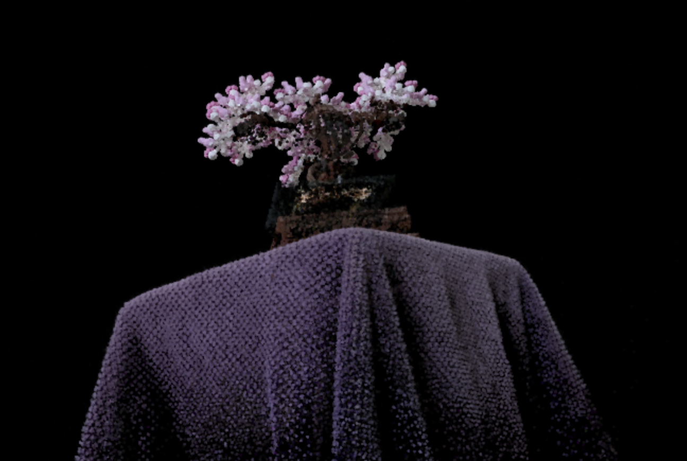
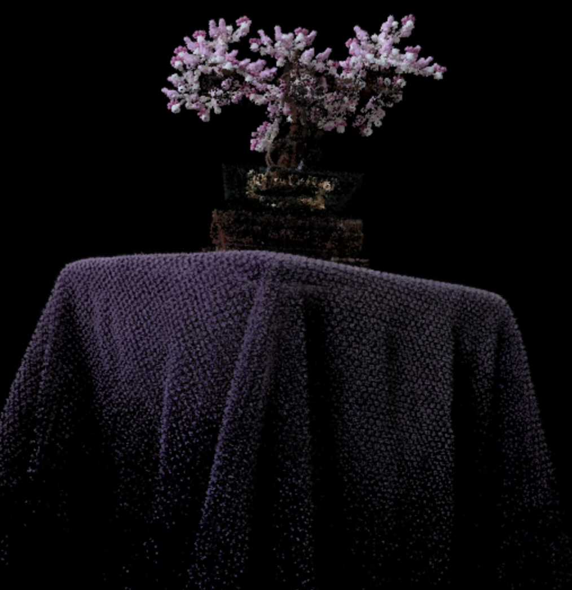
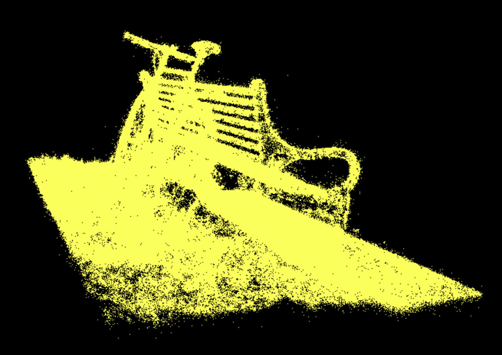
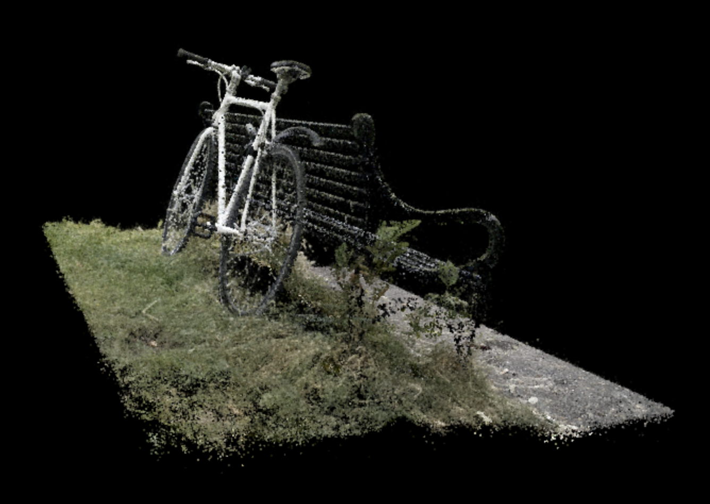

# University of Pennsylvania, CIS 5650: GPU Programming and Architecture
## Project 5 - WebGPU Gaussian Splat Viewer
* Zwe Tun
  * LinkedIn: https://www.linkedin.com/in/zwe-tun-6b7191256/
* Tested on: Intel(R) i7-14700HX, 2100 Mhz, RTX 5060 Laptop

---

## Overview  
The WebGPU Gaussian Splat Viewer renders 3D scenes using Gaussian Splatting, where each point is represented by a smooth 3D Gaussian instead of a triangle. Each Gaussian defines its position, color, scale, and opacity, and when projected to screen space, becomes an elliptical “splat.” The viewer preprocesses and sorts these splats on the GPU using WebGPU, then blends them back-to-front to form continuous surfaces. 

### Implementation Summary  

**Preprocessing (Compute Shader)**  
   Transforms each 3D Gaussian into camera space, performs view-frustum culling, and projects its covariance into a 2D ellipse.  
   Spherical harmonics are evaluated for color, producing visible splats ready for sorting.
   
   **High-Level Steps:**  
   1. Transform Gaussian means into camera space  
   2. Perform view-frustum culling to discard invisible splats  
   3. Project 3D covariance matrices into 2D screen-space conics  
   4. Evaluate spherical harmonics based on view direction to compute color  
   5. Output visible Gaussians with updated screen-space properties  

---

**Sorting (Compute Shader)**  
   Visible Gaussians are GPU-sorted by depth to ensure correct back-to-front transparency during rendering, preserving visual accuracy and avoiding blending artifacts.
   
   **High-Level Steps:**  
   1. Sort visible splats by depth using radix sort for correct transparency  
   2. Store sorted indices in a GPU buffer for efficient draw calls  

---

**Rasterization (Render Pipeline)**  
   Each Gaussian becomes a screen-space quad. The vertex shader positions it, and the fragment shader computes opacity and color from the ellipse footprint, blending results to form the final image.
   
   **High-Level Steps:**  
   1. Vertex shader expands each Gaussian into a 6-vertex quad (two triangles)  
   2. Fragment shader evaluates the Gaussian density for per-pixel opacity and color  
   3. Blending accumulates splats to form the final image  

### Comparison: Point Cloud vs. Gaussian Splat Rendering  

| Renderer | Visualization | Description |
|-----------|----------------|--------------|
| **Point Cloud Bonsai** |  | 
| **Gaussian Splat Bonsai** |  | 
| **Point Cloud Bicycle** |  | 
| **Gaussian Splat Bicycle**  |  | 

### Credits

- [Vite](https://vitejs.dev/)
- [tweakpane](https://tweakpane.github.io/docs//v3/monitor-bindings/)
- [stats.js](https://github.com/mrdoob/stats.js)
- [wgpu-matrix](https://github.com/greggman/wgpu-matrix)
- Special Thanks to: Shrek Shao (Google WebGPU team) & [Differential Guassian Renderer](https://github.com/graphdeco-inria/diff-gaussian-rasterization)
