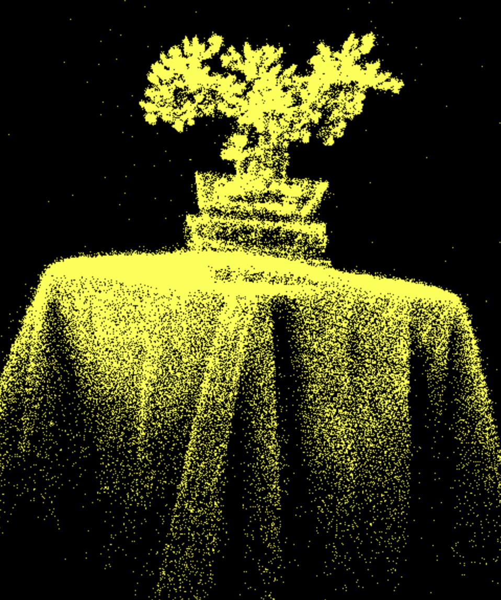

# University of Pennsylvania, CIS 5650: GPU Programming and Architecture
## Project 5 - WebGPU Gaussian Splat Viewer
* Zwe Tun
  * LinkedIn: https://www.linkedin.com/in/zwe-tun-6b7191256/
* Tested on: Intel(R) i7-14700HX, 2100 Mhz, RTX 5060 Laptop

---

## Overview  
The WebGPU Gaussian Splat Viewer renders 3D scenes using Gaussian Splatting, where each point is represented by a smooth 3D Gaussian instead of a triangle. Each Gaussian defines its position, color, scale, and opacity, and when projected to screen space, becomes an elliptical “splat.” The viewer preprocesses and sorts these splats on the GPU using WebGPU, then blends them back-to-front to form continuous surfaces. 

### Implementation Summary  

**Preprocessing (Compute Shader)**  
   Transforms each 3D Gaussian into camera space, performs view-frustum culling, and projects its covariance into a 2D ellipse.  
   Spherical harmonics are evaluated for color, producing visible splats ready for sorting.
   
   **High-Level Steps:**  
   1. Transform Gaussian means into camera space  
   2. Perform view-frustum culling to discard invisible splats  
   3. Project 3D covariance matrices into 2D screen-space conics  
   4. Evaluate spherical harmonics based on view direction to compute color  
   5. Output visible Gaussians with updated screen-space properties  

**Sorting (Compute Shader)**  
   Visible Gaussians are GPU-sorted by depth to ensure correct back-to-front transparency during rendering, preserving visual accuracy and avoiding blending artifacts.
   
   **High-Level Steps:**  
   1. Sort visible splats by depth using radix sort for correct transparency  
   2. Store sorted indices in a GPU buffer for efficient draw calls  

**Rasterization (Render Pipeline)**  
   Each Gaussian becomes a screen-space quad. The vertex shader positions it, and the fragment shader computes opacity and color from the ellipse footprint, blending results to form the final image.
   
   **High-Level Steps:**  
   1. Vertex shader expands each Gaussian into a 6-vertex quad (two triangles)  
   2. Fragment shader evaluates the Gaussian density for per-pixel opacity and color  
   3. Blending accumulates splats to form the final image  

---

### Comparison: Point Cloud vs. Gaussian Splat Rendering  

| Renderer | Visualization | Performance (Frames Per Second) |
|-----------|----------------|--------------|
| **Point Cloud Bonsai** |  | 170 FPS
| **Gaussian Splat Bonsai** |  | 51 FPS
| **Point Cloud Bicycle** |  | 165 FPS
| **Gaussian Splat Bicycle**  |  | 13 FPS

*Bonsai.ply loaded with 272956 points and Bicycle.ply loaded with 1063091 points*

### Analysis

The performance comparison shows that the point cloud renderer is significantly faster than the Gaussian splat renderer, achieving over 160 FPS on both the Bonsai and Bicycle scenes. This is expected because the point cloud approach simply projects individual points without additional preprocessing, depth sorting, or complex fragment shading. It is highly efficient for real-time visualization but produces sparse and less realistic images, especially for surfaces that require continuity.

In contrast, the Gaussian splat renderer requires multiple GPU-intensive steps, including view-frustum culling, 3D-to-2D covariance computation, spherical harmonics color evaluation, depth sorting, and blending. As a result, frame rates drop considerably (51 FPS for Bonsai and 13 FPS for Bicycle), particularly in scenes with many Gaussians. Despite the lower performance, this renderer produces realistic surfaces with depth and shading, showing the trade off between visual quality and computational cost.

View-frustum culling improves performance by removing Gaussians that are outside the camera’s view, reducing the number of splats to process, sort, and render. Finally, the total number of Gaussians directly impacts performance. More Gaussians require more memory, sorting operations, and shader computations, which lowers FPS. 

---

### Running the code
Follow these steps to install and view the project:

- Clone this repository
- Download and install Node.js
- Run npm install in the root directory of this project to download and install dependencies
- Run npm run dev, which will open the project in your browser

---

---

### Future Work  

While the Gaussian splat renderer produces viable reconstructions, the current implementation has several limitations. The render is not yet high-definition, and fine details can appear blurred, especially in areas with sparse Gaussian coverage. Additionally, some artifacts and noise are visible around edges and in overlapping regions.

Future improvements could include increasing this resolution and implementing adaptive splat sizes to better capture small features. More advanced filtering or anti-aliasing techniques could reduce visual noise and edge artifacts. Optimizing the overall preprocessing and rendenering pipelines, as well as leveraging tile-based or level-of-detail rendering, could also improve performance while maintaining fidelity for dense scenes.

---

### Credits

- [Vite](https://vitejs.dev/)
- [tweakpane](https://tweakpane.github.io/docs//v3/monitor-bindings/)
- [stats.js](https://github.com/mrdoob/stats.js)
- [wgpu-matrix](https://github.com/greggman/wgpu-matrix)
- [Ply Files](https://drive.google.com/drive/folders/1Fz0QhyDU12JTsl2e7umGi5iy_V9drrIW)
- [Psuedocode](https://github.com/kwea123/gaussian_splatting_notes)
- Special Thanks to: Shrek Shao (Google WebGPU team) & [Differential Guassian Renderer](https://github.com/graphdeco-inria/diff-gaussian-rasterization)
